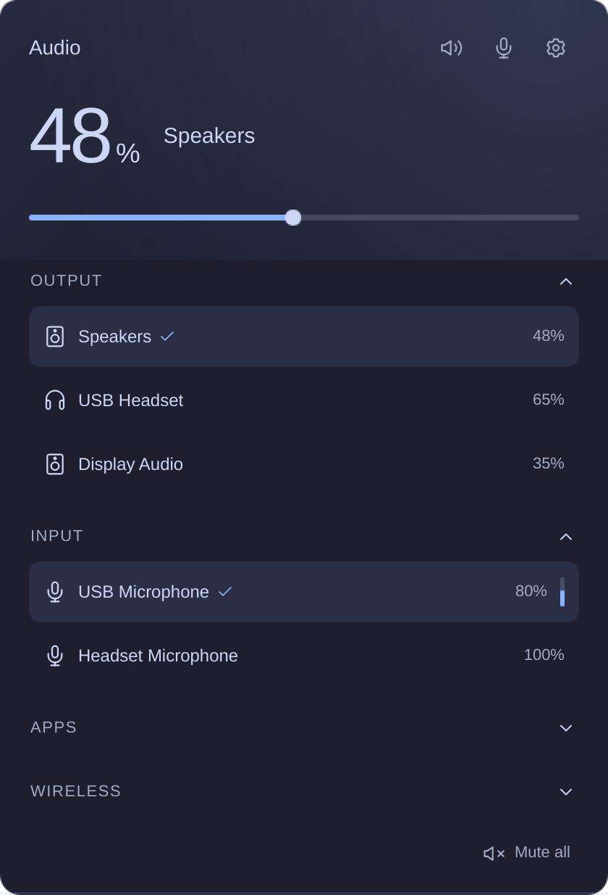

# Foamy Audio

Audio outputs, microphones, app volume, and AirPlay.



## Install

Requires Omarchy Quattro with PipeWire. For AirPlay, also install
`pipewire-zeroconf`, `pactl`, and `avahi-browse`.

```sh
omarchy plugin add https://github.com/foamrider/foamy-audio.git --enable
```

Remove the previous audio widget from the bar when replacing it.

## Use

- Left-click the widget to open the panel. Select a device row to switch to it.
- Hover over a row to reveal its volume slider. Expand Apps for per-app volume.
- Use the speaker and microphone icons to mute each channel. Right-click the
  bar widget to mute both; scroll to adjust output volume.
- Open the cog to change language, bar percentage, and scroll step. Settings
  are saved in Omarchy's `shell.json`.
- Expand Wireless to select an AirPlay speaker. The vertical meter shows the
  selected microphone's input level.

## License

Licensed under [MIT](LICENSE). Omarchy and Lucide notices are in
[LICENSE-OMARCHY](LICENSE-OMARCHY) and [LICENSE-LUCIDE](LICENSE-LUCIDE).

Provided **as is**, without warranty or guaranteed support. Use at your own risk.
